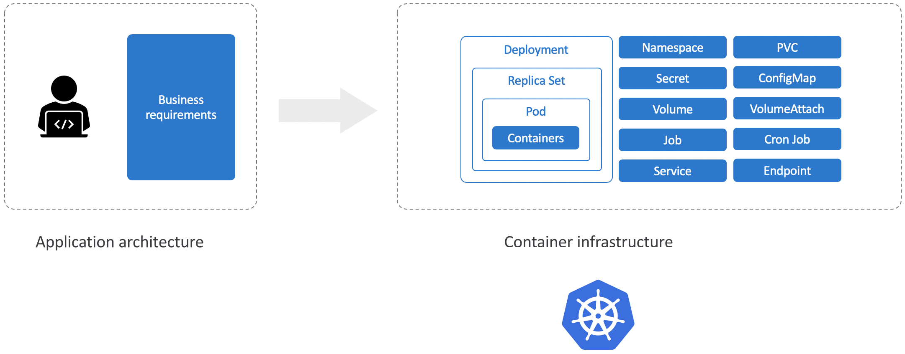
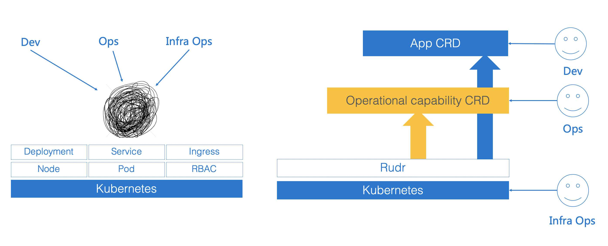

# Rudr: A Kubernetes Implementation of the Open Application Model

[Open Application Model (OAM)](https://github.com/oam-dev/spec/blob/master/1.purpose_and_goals.md) is a portable application definition which provides a platform-agnostic approach to describe cloud and edge applications. OAM's philosophy is building application centric infrastructure which let users choose where to run application based on **application level concerns**. In order for this model to work, a runtime needs to implement [OAM spec](https://github.com/oam-dev/spec).

Rudr is the reference OAM implementation for Kubernetes. 

> Note: Rudr is currently in alpha. It may reflect the API or features we are vetting before inclusion into the Open App Model spec.

## Modeling cloud-native applications should not be hard

Developers want to think in terms of application architecture, not of infrastructure. 

However, achieving this directly with Kubernetes is hard. At the heart of it, container orchestration systems inextricably mixes application primitives with infrastructure primitives. Different roles, such as developers and operators, have to concern themselves with problems from each other's domain as well as learning infrastructure details in order to understand the whole picture of the deployment.

This introduced the following problems for application deployment and management:

- It is difficult to model and describe applications from developers' view.
- It lacks manageability and discoverability for operational capabilities from operators' view.
- Both developers and operators have to work with "platform for platform" API of Kubernetes which is pretty low level and mostly designed for infra operators.

## An application centric Kubernetes with Rudr

To solve these problems, Rudr models applications with [OAM primitives](https://github.com/oam-dev/spec/blob/master/2.overview_and_terminology.md) so to provide **application centric abstraction** for Kubernetes. 

Rudr is essentially a set of Kubernetes CRDs + controllers so users still use `kubectl` to manage their applications natively, but with application level API ([Components](./docs/concepts/component-schematic.md)) for developers, and operational capability level API ([Traits](./docs/concepts/traits.md)) for operators. Meanwhile, infra operators still work on Kubernetes itself.

Currently, Rudr leverages pre-installed traits and workload types to accomplish the task. While in the upcoming releases, Rudr will provide a plugin technology to integrate any given operational capability and workload type defined by CRD and Operator. See [Extended Workload](./docs/README.md#extended-workloads).

## How to: Create an app from scratch

Get started with a [How-To](./docs/how-to/create_component_from_scratch.md) guide.

## Try more things out yourself 

Read the [documentation list](./docs/README.md) for more options.

## Contributing

This project welcomes contributions and suggestions. See [CONTRIBUTING.md](CONTRIBUTING.md) for more details. Below are links to join the bi-weekly community meetings and our meeting notes. Community Slack channels & mailing lists will be added shortly (~ 10/1).

| Item        | Value  |
|---------------------|---|
| Mailing List | https://groups.google.com/forum/#!forum/oam-dev |
| Meeting Information | [Bi-weekly (Starting Oct 22, 2019), Tuesdays 10:30AM PST](https://calendar.google.com/calendar?cid=dDk5YThyNGIwOWJyYTJxajNlbWI0a2FvdGtAZ3JvdXAuY2FsZW5kYXIuZ29vZ2xlLmNvbQ) |
|  | [Bi-weekly APAC (Starting Dec 24, 2019), Tuesdays 1:00PM GMT+8](https://calendar.google.com/event?action=TEMPLATE&tmeid=MzJnbHR2b3R1bHYxMG0wc2YybDJjZmhuc2pfMjAxOTEyMjRUMDUwMDAwWiBmZW5namluZ2NoYW9AbQ&tmsrc=fengjingchao%40gmail.com&scp=ALL)|
| Meeting Link | https://zoom.us/j/271516061  |
| IM Channel       | https://gitter.im/oam-dev/  |
| Meeting Notes       | https://docs.google.com/document/d/1nqdFEyULekyksFHtFvgvFAYE-0AMHKoS3RMnaKsarjs/edit?usp=sharing |
| Twitter      | [@oam_dev](https://twitter.com/oam_dev) |

## Governance

This project follows governance structure of numerous other open source projects. See [governance.md](governance.md) for more details.

## License

This project is available under the terms of the MIT license. See [LICENSE.txt](LICENSE.txt).
