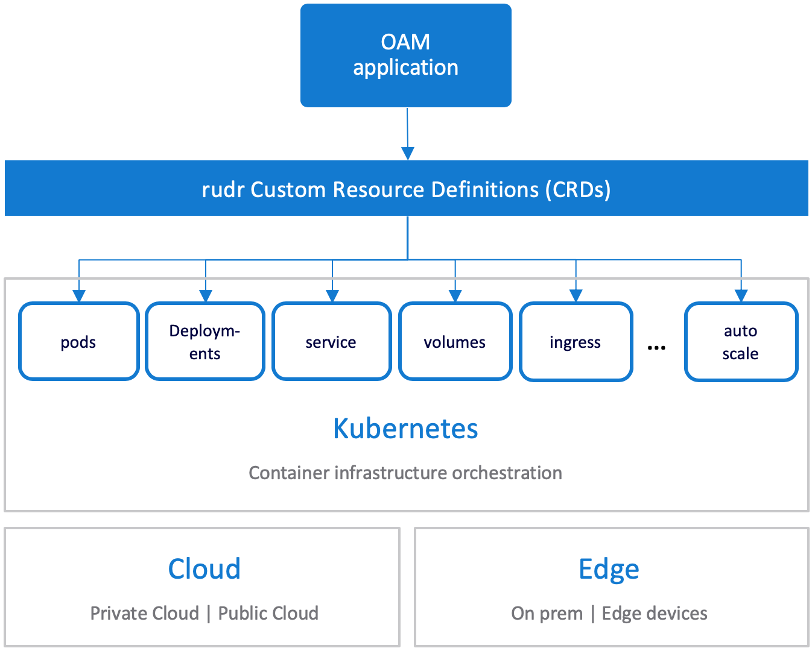

# Rudr: A Kubernetes Implementation of the Open Application Model

The [Open Application Model (OAM)](https://github.com/oam-dev/spec/blob/master/1.purpose_and_goals.md) is a portable application definition which provides a platform-agnostic way to describe cloud and edge applications together with corresponding operational capabilities. OAM lets application maintainers choose where to run application (i.e. runtime) based on **application level concerns** instead of struggling with low level primitives, i.e. an "application centric infrastructure" approach. 

In order for this model to work, a runtime needs to "implement" [OAM spec](https://github.com/oam-dev/spec) so to expose its platform capabilities as Traits and accept corresponding workloads as Components to run.

Rudr is the reference OAM implementation for [Kubernetes](https://kubernetes.io/).

**Rudr is currently in alpha. It may reflect the API or features we are vetting before inclusion into the Open App Model spec.**

## How to: Create an app from scratch

Get started with a [How-To](./docs/how-to/create_component_from_scratch.md) guide.

## Users want to think application in terms of architecture, not of infrastructure

Achieving this directly with Kubernetes is complex. At the heart of it, container orchestration platform inextricably mixes application primitives with infrastructure primitives. Different roles, such as developers and operators, have to concern themselves with problems from each other's domain as well as infrastructure details in order to understand the whole picture of the deployment.

The requirement to deeply understand the container infrastructure has introduced the following problems for application deployment and management:

- It makes it difficult to model and define modern portable applications.
- It lacks manageability and discoverability for operational capabilities.
- It is difficult to have a efficient and accurate interaction between infra operators, app operators and developers. Users are exposed to constructs outside their domain that they have to learn to accomplish day-to-day tasks.

## Rudr: an Application Centric Kubernetes powered by OAM

As a set of plugins that allows OAM specifications to be implemented and deployed on Kubernetes clusters, Rudr provides a extra application centric abstraction to vanilla Kubernetes including `Component` for app developers and `Trait` for app operators. With implementation of CRD and controller, users of Rudr will still use `kubectl` to model, define and manage applications but follow the philosophy of OAM.

- OAM allows app developers to focus on describing application components from their own perspectives.

- OAM allows app operators to focus on generic operational capabilities instead of struggling in [infinite infrastructure level details](https://medium.com/flant-com/comparing-ingress-controllers-for-kubernetes-9b397483b46b) from various execution runtime.

Essentially, with Rudr installed, participators in Kubernetes application management workflow will be able to work around application centric concerns such as "what is this application about", "what's its latency requirement", and "how to scale it" etc rather than low level infrastructure primitives. Meanwhile, the infra operators will continue focus on Kubernetes itself.

Currently, Rudr will leverage the pre-installed traits and workload types to accomplish the task. In the upcoming releases, Rudr will provide a plugin technology to integrate any operational capability and workload type defined by any external CRD and Operator. See [Extended Workload](./docs/README.md#extended-workload).

## Try more things out yourself 

Read the [documentation list](./docs/README.md) for more options.

## Contributing

This project welcomes contributions and suggestions. See [CONTRIBUTING.md](CONTRIBUTING.md) for more details. Below are links to join the bi-weekly community meetings and our meeting notes. Community Slack channels & mailing lists will be added shortly (~ 10/1).

| Item        | Value  |
|---------------------|---|
| Mailing List | https://groups.google.com/forum/#!forum/oam-dev |
| Meeting Information | [Bi-weekly (Starting Oct 22, 2019), Tuesdays 10:30AM PST](https://calendar.google.com/calendar?cid=dDk5YThyNGIwOWJyYTJxajNlbWI0a2FvdGtAZ3JvdXAuY2FsZW5kYXIuZ29vZ2xlLmNvbQ) |
|  | [Bi-weekly APAC (Starting Dec 24, 2019), Tuesdays 1:00PM GMT+8](https://calendar.google.com/event?action=TEMPLATE&tmeid=MzJnbHR2b3R1bHYxMG0wc2YybDJjZmhuc2pfMjAxOTEyMjRUMDUwMDAwWiBmZW5namluZ2NoYW9AbQ&tmsrc=fengjingchao%40gmail.com&scp=ALL)|
| Meeting Link | https://zoom.us/j/271516061  |
| IM Channel       | https://gitter.im/oam-dev/  |
| Meeting Notes       | https://docs.google.com/document/d/1nqdFEyULekyksFHtFvgvFAYE-0AMHKoS3RMnaKsarjs/edit?usp=sharing |
| Twitter      | [@oam_dev](https://twitter.com/oam_dev) |

## Governance

This project follows governance structure of numerous other open source projects. See [governance.md](governance.md) for more details.

## License

This project is available under the terms of the MIT license. See [LICENSE.txt](LICENSE.txt).
